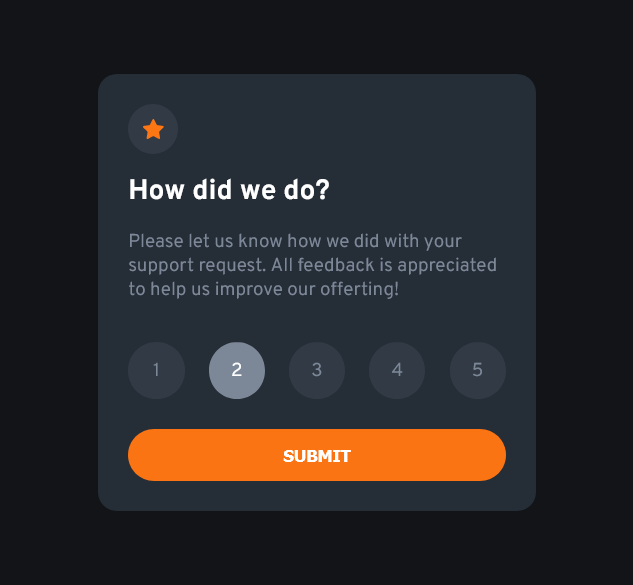

# Frontend Mentor - Interactive rating component solution

This is a solution to the [Interactive rating component challenge on Frontend Mentor](https://www.frontendmentor.io/challenges/interactive-rating-component-koxpeBUmI). Frontend Mentor challenges help you improve your coding skills by building realistic projects.

## Table of contents

- [Overview](#overview)
  - [The challenge](#the-challenge)
  - [Screenshot](#screenshot)
- [My process](#my-process)
  - [Built with](#built-with)
  - [What I learned](#what-i-learned)

**Note: Delete this note and update the table of contents based on what sections you keep.**

## Overview

### The challenge

Users should be able to:

- View the optimal layout for the app depending on their device's screen size
- See hover states for all interactive elements on the page
- Select and submit a number rating
- See the "Thank you" card state after submitting a rating

### Screenshot




## My process

### Built with

- Semantic HTML5 markup
- CSS custom properties
- Flexbox
- Mobile-first workflow

### What I learned

Using the `label` element to make a custom radio button :

Put the `input` element above the `label` to make the CSS selector `+` works :

```html
<input type="radio" id="rating-score-1" name="rating-score" value="1" />
<label class="rating__score-button" for="rating-score-1">1 </label>
```

The input is not visible due to the `appearance: none;` property. Whenver we click the label, the input would be checked.

```css
.rating__score-button {
	display: inline-block;
	position: relative;
	background: var(--button-bg);
	width: 45px;
	height: 45px;
	border-radius: 50%;

	/* Center the label text */
	display: flex;
	justify-content: center;
	align-items: center;
}

.rating__score-button:hover {
	background-color: var(--primary-color);
	color: var(--white);
	cursor: pointer;
}

input {
	/* Hide the input. When we click the label, the input would be checked. */
	appearance: none;
	position: absolute;
}

input:checked + .rating__score-button {
	background-color: var(--medium-grey);
	color: var(--white);
}
```
